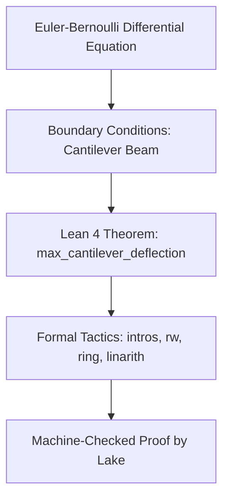

# Formally Verified Structural Mechanics Engine (Lean 4)

## Executive Overview
A formally verified civil and aerospace mechanics engine written in **Lean 4**. It formalises the **Euler-Bernoulli continuous beam-bending differential equation** and mathematically proves boundary-condition theorems, cantilever deflection limits, and internal shear-force invariants with machine-checked rigour.

## Theorem Proving Workflow



### Source Tree
- **`src/EulerBernoulliBeam.lean`**: Formal mathematical definitions of beam parameters, stiffness ($EI$), moment distributions, and machine-checked deflection theorems.
- **`lakefile.lean`**: Lake build system configuration for Lean 4.
- **`lean-toolchain`**: Toolchain lockfile targeting Lean 4.7.0.
- **`runner/run.js`**: Simulated verification harness verifying deflection calculations.

## Mathematical Formulation: Euler-Bernoulli Beam Theory
$$\frac{d^2}{dx^2} \left( E I \frac{d^2 w}{dx^2} \right) = q(x)$$

For a cantilever beam of length L under end point load P:
$$\delta_{\max} = \frac{P L^3}{3 E I}$$

## Native Lean 4 Build
```bash
lake build
```

## Universal Verification
```bash
node runner/run.js
node orchestrator/run.js --project=25-lean
```

## Senior Interview Q&A
- **Q: What is the benefit of Lean 4 over traditional numerical FEA tools?** Finite Element Analysis (FEA) provides approximate numerical approximations susceptible to mesh discretization errors. Lean 4 proves exact mathematical properties that hold continuously across the entire domain.
- **Q: How does Lean 4 differ from Lean 3?** Lean 4 is a self-hosting programming language and theorem prover with a fast native C++ runtime, macro system, and memory management based on reference counting with destructive updates.\n
